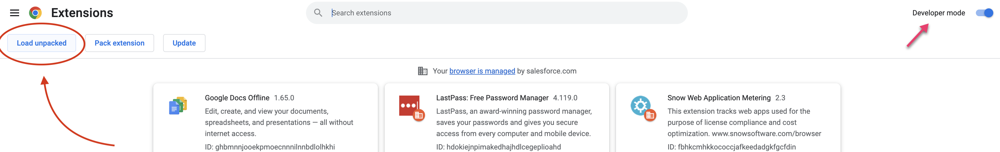
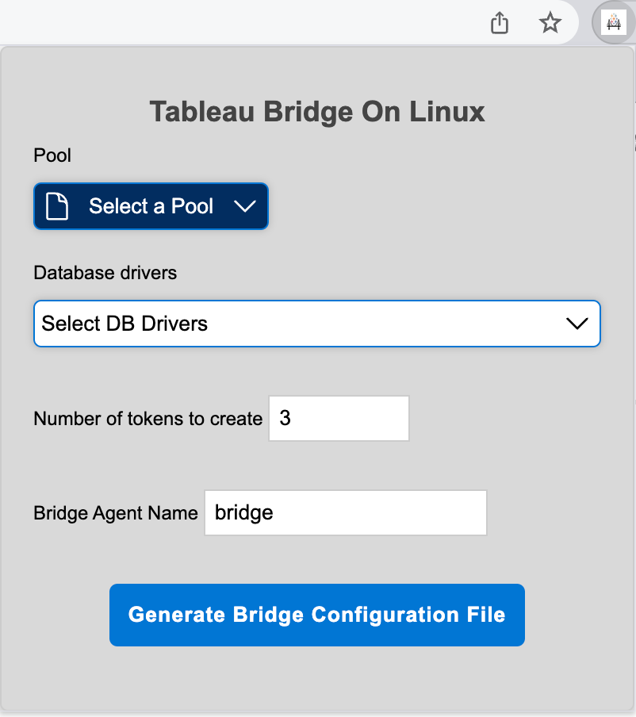

# Tableau Bridge for Linux Chrome Extension

### Overview
This Google Chrome extension makes it easy to collect the settings as a yaml file needed to run Tableau Bridge on Linux containers. 
It allows the user to select the Pool, DB drivers, number of tokens to create, and Bridge agent name which is then downloaded as a 
yaml file to be used in automation scripts for creating and running Bridge on Linux containers.

### Instructions

#### 1. Clone this repo to your local machine 
    ```
    git clone https://github.com/josephflu/datadevdays23
    ```

#### 2. Navigate to Google Chrome's Extensions in your browser
Navigate to the extensions page in Google Chrome by entering the following URL:
```
chrome://extensions/
```

#### 3. Enable Developer Mode on the top right and press the "Load unpacked" button on the Chrome Extensions Page



#### 4. Select the extensions/ folder 
Note that the extensions/ folder contains the manifest.json file which defines the chrome extension.

```
  extension/
```

#### 5. Pin the Extension
From the Chrome Extensions menu, right-click the extension and select 'Pin' to keep it easily accessible.


#### 6. Log In to Tableau Online
Visit https://online.tableau.com and navigate to the Bridge settings page within Tableau Cloud.

#### 7. Generate YAML File
Click the extension icon, select your preferences for the pool, database drivers, the number of tokens, and the Bridge agent name. Then, click the 'Generate' button.



A YAML file containing the newly created PAT tokens and other metadata will be generated, which is needed for onboarding new managed bridge agents.

[Example Generated config.yml File](../bridge_docker_automation/bridge_config.example.yml)


