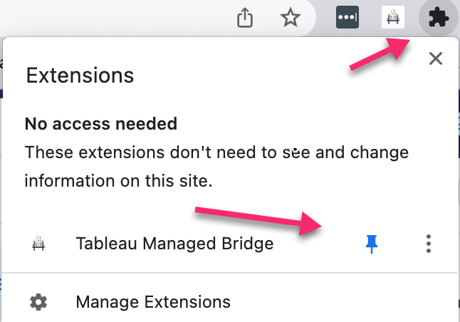
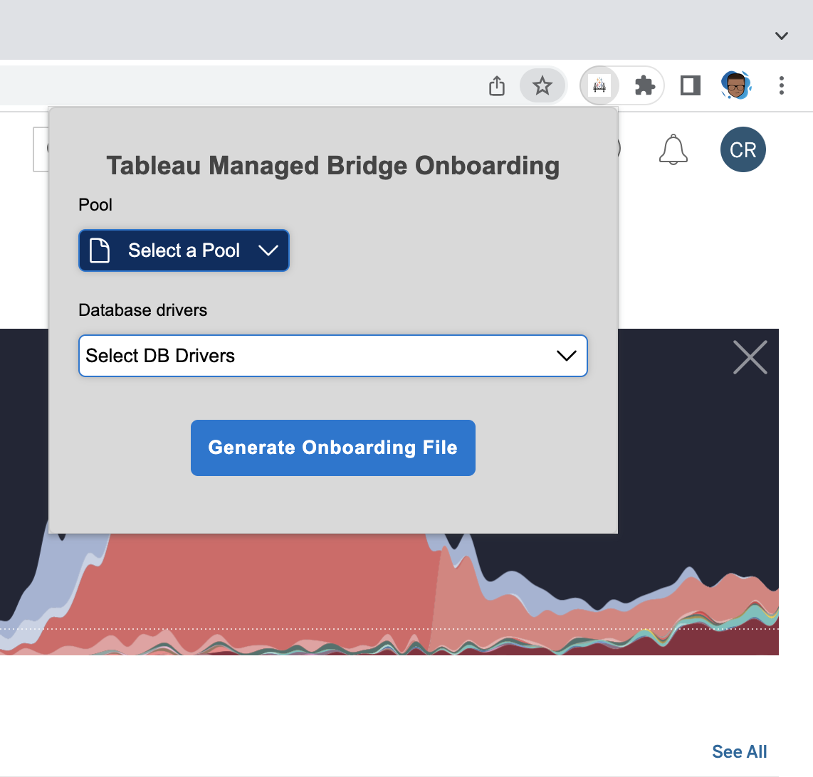

# Tableau Bridge for Linux Chrome Extension


#### 1. Navigate to Google Chrome's Extensions

```
  chrome://extensions/
```
#### 2. Enable Developer Mode on the top right and press the "Load unpacked" button on the Chrome Extenstion Page


#### 3. Select this folder from the current project

```
  extension/
```

#### 4. From the Chrome Extensions Menu, right click and pin the extension 


#### 5. Login to https://online.tableau.com

Navigate to the bridge settings page

#### 6. Open the extension, select a pool and a set of DB drivers, number of tokens to create, and Bridge agent name, and press the Generate Bridge configuration file button.

Note that a yaml file containing the newly created PAT tokens and other metadata needed to onboard a new 
managed bridge bridge agents.


