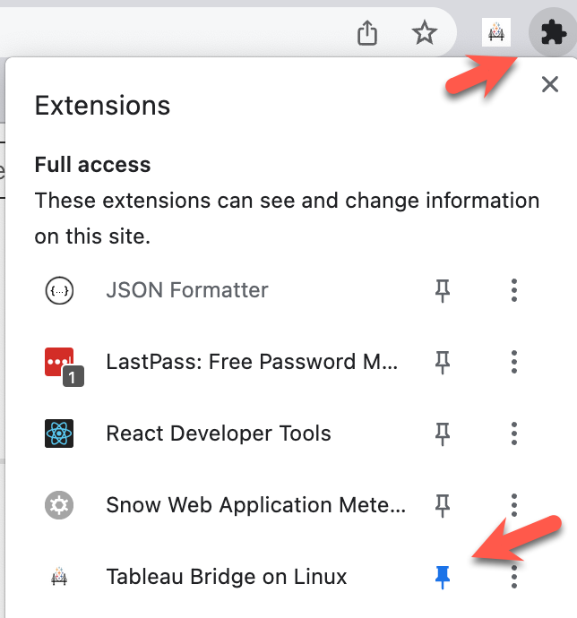

# Tableau Bridge for Linux Chrome Extension

### Overview
This Google Chrome extension makes it easy to collect the settings as a yaml file needed to run Tableau Bridge on Linux containers. 
It allows the user to select the Pool, DB drivers, number of tokens to create, and Bridge agent name.
The extension then generates a yaml file containing the newly created PAT tokens and other metadata needed to start an agent.

### Instructions

#### 1. Clone this repo to your local machine 
    ```
    git clone https://github.com/josephflu/datadevdays23
    ```

#### 2. Navigate to Google Chrome's Extensions in your browser

chrome://extensions/
  
#### 3. Enable Developer Mode on the top right and press the "Load unpacked" button on the Chrome Extensions Page


#### 4. Select this folder from the current project
This is the folder where the manifest.json file is located.

```
  extension/
```

#### 5. From the Chrome Extensions Menu, right click and pin the extension 


#### 6. Login to https://online.tableau.com

Navigate to the bridge settings page in Tableau Cloud

#### 7. Open the extension, select a pool and a set of DB drivers, number of tokens to create, and Bridge agent name, and press the Generate button.


Note that a yaml file containing the newly created PAT tokens and other metadata needed to onboard a new 
managed bridge agents.

[Example Generated config.yml File](../bridge_docker_automation/bridge_config.example.yml)
